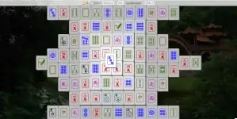

# Mahjongg Solitaire

A simple Mahjongg Solitaire game, using HTML + CSS + JS with a timer and points.

Main advantages:

- Basic accessibility (contrasts, labels, keyboard-only)
- Should work on most devices and browsers (auto-resize)
   - It is recommended to play this game on mobile devices in landscape
- Fast even on slower devices
- Only around 84 KiB in total
- No personal data collection, analytics, cookies etc.
- No external dependencies or assets (e.g. frameworks, images, composer/npm/yarn packages)
- No vibe-coded / "AI"-generated part

## Installation

1. Clone this repo somewhere inside your webserver root.
2. That's it.

Unfortunately, you cannot play the game by just opening the HTML file in a browser, since modern browsers have [CSP rules](https://developer.mozilla.org/en-US/docs/Web/HTTP/Guides/CSP) for `file` protocol that block CSS and/or JS files ("inlining" styles/scripts won't work as well).

There are some simple web server solutions out there that work out-of-the-box and can be used for
local playing.

If you want to just try playing the current version, go to [https://tommander.cz/mahjongg/](https://tommander.cz/mahjongg/).

## Game Rules

You have 144 tiles that are placed in a predefined "turtle" shape.

Your goal is to pick pairs of tiles with an identical symbol (or any two Flower/Season) until there is no block left on the board.

You can only pick a block that:

- is not blocked by another block above it, and
- has at least one long edge free.

Types of tiles:

- Suited tiles
   - Character (9 ranks, 4x each)
   - Circle (9 ranks, 4x each)
   - Stick (9 ranks, 4x each)
- Honors tiles
   - Wind (4 kinds, 4x each)
   - Dragon (3 kinds, 4x each)
- Bonus tiles
   - Flower (4 tiles)
   - Season (4 tiles)

By clearing a pair of tiles, you get points according to their type:

- Character = 2 pts
- Circle = 4 pts
- Bamboo = 6 pts
- Wind = 8 pts
- Dragon = 10 pts
- Flower = 12 pts
- Season = 14 pts

There is no time restriction for the game.

## Development

There is certianly *plenty* of room for improvements, bug fixes, and new features.

Feel free to read [DEVELOPMENT.md](DEVELOPMENT.md) for some quick onboarding.

I'll be very thankful if you:

- share your work via PR,
- raise an Issue if you do not plan to have a look at it yourself,
- help in any other way with this tiny little project,
- help some people that really need it.

## License

[Mahjongg Solitaire](https://github.com/tommander/mahjongg) by [Tomáš Rajnoha](https://tommander.cz) is marked [CC0 1.0](LICENSE).

[Background photo](https://get.pxhere.com/photo/architecture-bridge-river-jungle-garden-waterway-rainforest-china-rural-area-arch-bridge-leshan-1166576.jpg) from [Pxhere](https://pxhere.com/ko/photo/1166576) is also marked [CC0 1.0](https://creativecommons.org/publicdomain/zero/1.0/).
